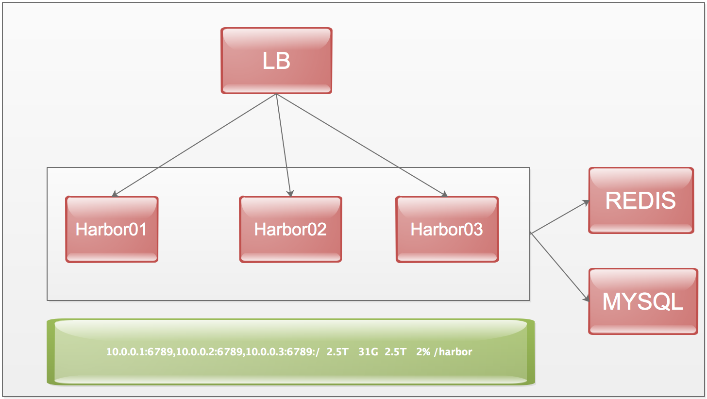

## harbor 高可用部署 
  
 
 
 数据库使用外接的mysql  redis 解决session 问题  
 
    
### 1.cephfs 部署
#### 1.1 机器列表 
   
    10.0.0.1        harbor-ceph-node1 
    10.0.0.2        harbor-ceph-node2 
    10.0.0.3        harbor-ceph-node3 
    10.0.0.4        harbor-ceph-node4 
    10.0.0.5        harbor-ceph-node5 

#### 1.2 安装ceph-deploy   
     
   1.2.1 添加ceph 源 
     
    我在跳板机上(10.0.0.10)安装ceph-deploy    
   [http://docs.ceph.org.cn/install/get-packages/]() 参考资料 
   
   vim /etc/yum.repos.d/ceph.repo 
	
	[ceph]
	name=Ceph packages for $basearch
	baseurl=http://download.ceph.com/rpm-luminous/el7/$basearch
	enabled=1
	priority=2
	gpgcheck=1
	type=rpm-md
	gpgkey=https://download.ceph.com/keys/release.asc
	
	[ceph-noarch]
	name=Ceph noarch packages
	baseurl=http://download.ceph.com/rpm-luminous/el7/noarch
	enabled=1
	priority=2
	gpgcheck=1
	type=rpm-md
	gpgkey=https://download.ceph.com/keys/release.asc
	
	[ceph-source]
	name=Ceph source packages
	baseurl=http://download.ceph.com/rpm-luminous/el7/SRPMS
	enabled=0
	priority=2
	gpgcheck=1
	type=rpm-md
	gpgkey=https://download.ceph.com/keys/release.asc 
	   
  使用的版本是rpm-luminous,系统为el7    
   
   1.2.2 安装release.asc 密钥 
      
       rpm --import 'https://download.ceph.com/keys/release.asc'  
     
   1.2.3 安装ceph-deploy(10.0.0.10) 
      
       yum install ceph-deploy -y 
   
#### 1.3  安装NTP SSH 
      
      在所有的ceph 节点安装NTP 和SSH  
      yum install ntp ntpdate ntp-doc  -y
      yum install openssh-server -y       
    
#### 1.4 创建ceph 用户
       
   1.4.1 在各ceph 节点创建新用户
       
     useradd -d /home/ceph -m ceph        
     passwd ceph    
    
   1.4.2 确保各ceph节点新创建的用户都有sudo 权限
      
     echo "ceph ALL = (root) NOPASSWD:ALL" | sudo tee /etc/sudoers.d/ceph
     chmod 0440 /etc/sudoers.d/ceph
     
   1.4.3 生成ssh密钥对 
       
       su - ceph 
       ssh-keygen  直接回车就行
   
   1.4.4 把公钥拷贝到ceph 节点
     
    ssh-copy-id -i .ssh/id_rsa.pub ceph@10.0.0.1      
     ......
    
   1.4.5 使用ssh 配置文件
      
    su - ceph 
    vi  .ssh/config 
      Host node1
        Hostname harbor-ceph-node1
        User ceph
	   Host node2
		        Hostname harbor-ceph-node2
		        User ceph
		Host node3
		        Hostname harbor-ceph-node3
		        User ceph
		Host node4
		        Hostname harbor-ceph-node4
		        User ceph
		Host node5
		        Hostname harbor-ceph-node5
		        User ceph
		        
	  chmod  644  .ssh/config  
      需要在ceph 节点上做一下hosts 解析 
      
#### 1.5 创建分区  
      
      为ceph 单独挂载一个独立磁盘 
      fdisk /dev/vdc			    
      mkfs.xfs /dev/vdc1 
      mkdir /ceph-harbor
      blikd
      写如到 /etc/fstab 
      mount  /dev/vdc1  /ceph-harbor      
    
#### 1.6 安装存储集群 
    
    创建ceph 存储集群，它有3个monitor 和5个osd 守护进程。
    
    在10.0.0.10上面 
    su - ceph
    mkdir my-cluster 
    cd my-cluster 
    使用sudo 注意事项
    禁用 requiretty
    在某些发行版（如 CentOS ）上，执行 ceph-deploy 命令时，如果你的 Ceph 节点默认设置了 requiretty 那就会遇到报错。可以这样禁用此功能：执行 sudo visudo ，找到 Defaults requiretty 选项，把它改为 Defaults:ceph !requiretty ，这样 ceph-deploy 就能用 ceph 用户登录并使用 sudo 了。 
   
##### 1.6.1 创建集群
     
     ceph-deploy new {initial-monitor-node(s)}
     
     ceph-deploy new  node1 node2 node3  
     #会在界面进行输出，网络状态好的情况下应该没有问题，不行的话可以替换一下hosts，在github上找一个可以翻墙的hosts 文件
     
      ceph.conf 配置文件默认的副本数3，可以在[global] 段： 
      osd pool default size = 2 
      如果有多个网卡，可以public network 写入ceph配置文件的[global] 
      public network = {ip-address}/{netmask} 
   网络配置参考[http://docs.ceph.org.cn/rados/configuration/network-config-ref/]()   
      
##### 1.6.2 安装ceph 
     
     ceph-deploy install {ceph-node} [{ceph-node} ...]      
     ceph-deploy install  node1 node2 node3 node4 node5 
     ceph-deploy 将在各节点安装ceph，
     
     安装失败可以清除重新安装
     ceph-deploy purge {ceph-node} [{ceph-node}]
     
        
     配置初始 monitor(s)、并收集所有密钥：
     ceph-deploy mon create-initial

##### 1.6.3 配置初始化monitor(s) 并收集所有密钥 
     
     ceph-deploy mon create-initial
     
     完成上述操作后，当前目录里应该会出现这些密钥环：
		{cluster-name}.client.admin.keyring
		{cluster-name}.bootstrap-osd.keyring
		{cluster-name}.bootstrap-mds.keyring
		{cluster-name}.bootstrap-rgw.keyring
    
##### 1.6.4 部署OSD  
    
    ceph-deploy osd prepare {ceph-node}:/path/to/directory
       
    ceph-deploy osd prepare harbor-ceph-node1:/ceph-harbor harbor-ceph-node2:/ceph-harbor harbor-ceph-node3:/ceph-harbor harbor-ceph-node4:/ceph-harbor harbor-ceph-node5:/ceph-harbor
   
##### 1.6.4 激活OSD
   
    ceph-deploy osd activate {ceph-node}:/path/to/directory
    
    ceph-deploy osd activate harbor-ceph-node1:/ceph-harbor harbor-ceph-node2:/ceph-harbor harbor-ceph-node3:/ceph-harbor harbor-ceph-node4:/ceph-harbor harbor-ceph-node5:/ceph-harbor
   
##### 1.6.5 检查集群状态  
     
     ceph health   
   
#### 1.7 创建cephfs 
##### 1.7.1  创建元数据库服务器 
     
     至少需要一个元数据服务器才能使用 CephFS ，执行下列命令创建元数据服务器：  
     ceph-deploy mds create {ceph-node}

     创建mds  
     ceph-deploy mds create harbor-ceph-node1
     # 因为我有3个副本，创建一个mds 就可以了
##### 1.7.2 查看元数据的状态   
    ceph mds stat
    e5: 1/1/1 up {0=harbor-ceph-node1=up:active}
 
##### 1.7.3 创建文件系统
  存储池、归置组配置参考 [http://docs.ceph.org.cn/rados/configuration/pool-pg-config-ref/]()
  
 [http://docs.ceph.org.cn/rados/operations/placement-groups/]()
 
##### 1.7.4 创建存储池 
    要用默认设置为文件系统创建两个存储池
    ceph osd pool create cephfs_data <pg_num>  
    ceph osd pool create cephfs_metadata <pg_num>
  
    创建存储池
    ceph osd pool create cephfs_data 625
    ceph osd pool create cephfs_metadata 625
  
##### 1.7.6 创建文件系统  
     
     创建好存储池后，你可以用fs new 命令创建文件系统：
     ceph fs new <fs_name> <metadata> <data>  
     ceph fs new cephfs cephfs_metadata cephfs_data 
    
     ceph fs ls 
     name: cephfs, metadata pool: cephfs_metadata, data pools: [cephfs_data ] 

##### 1.7.7  查看状态  
    文件系统创建完毕后，MDS 服务器就能active, 比如在一个单MDS 系统中： 
    ceph mds stat 
    e5: 1/1/1 up {0=harbor-ceph-node1=up:active} 
    
   
#### 1.8 客户端mount cephfs      
  参考资料 [http://docs.ceph.org.cn/cephfs/kernel/]()
  
  [http://docs.ceph.org.cn/start/quick-cephfs/#id3]()  
 
    客户端： 
       第一步  创建挂载目录 
            mkdir  /harbor 
       第二步  查看cephfs 秘钥 
       name 和secret 在ceph 的osd 下面目录去获取 
       cat /etc/ceph/ceph.client.admin.keyring
       
       第三步 mount 文件系统 
       如果有多个监视器：
       mount.ceph monhost1,monhost2,monhost3:/ /mnt/foo
       mount -t ceph  10.0.0.1:6789,10.0.0.2:6789,10.0.0.3:6789:/ /harbor  -o name=admin,secret=AQCprj5ZAilVHRAA73bX47zr2fGKpIwgk/DGsA==
      
       第四步 写入fstab 
   参考资料 [http://docs.ceph.com/docs/master/cephfs/fstab/]()
       
       vim /etc/fstab   
       10.0.0.1:6789,10.0.0.2:6789,10.0.0.3:6789:/ /harbor   ceph    name=admin,secret=AQCprj5ZAilVHRAA73bX47zr2fGKpIwgk/DGsA==,noatime,_netdev    0      0  
              
### 2 harbor 安装

    机器列表
     10.0.0.12   harbor02 
     10.0.0.13   harbor03
    
#### 2.1 安装docker  
  [https://docs.docker.com/engine/installation/linux/centos/#install-from-a-package]()
  
    yum install -y yum-utils device-mapper-persistent-data lvm2 
    yum-config-manager \
    --add-repo \
    https://download.docker.com/linux/centos/docker-ce.repo
    yum-config-manager --enable docker-ce-edge
    yum install docker-ce  -y
    
      
#### 2.2 安装docker-compose  
   
     curl -L https://github.com/docker/compose/releases/download/1.13.0/docker-compose-`uname -s`-`uname -m` > /usr/local/bin/docker-compose
     chmod +x /usr/local/bin/docker-compose
    
     docker-compose --version
     docker-compose version 1.13.0, build 1719ceb 
     
#### 3.安装harbor  
         
##### 3.1 下载harbor 
     
  harbor 程序包下载 [https://github.com/vmware/harbor/releases]()     
  
     安装目录/opt/harbor
     ./prepare
     ./install.sh 
    默认安装导出数据库 
##### 3.2 harbor  数据库导出 
  
    docker exec -ti 2f2df11a189f bash 
    
    #数据库的默认密码在cat common/config/adminserver/env  中查看
    
    mysqldump -u root -p --databases registry > registry.dump
    
    退出container,将备份的数据copy 出来
    
    docker cp 2f2df11a189f:/tmp/registry.dump .  
    
##### 3.3 导入数据库文件
   
     mysql -uharbor -h 10.0.0.250 -p 
     source ./registry.dump;
     
     
##### 3.4 配置外接数据库 

     cp docker-compose.yml docker-compose.yml.bak       
     
     修改docker-compose.yml 删除的部分，并将以前的80端口修改为8090 
>     mysql:
>     image: vmware/harbor-db:v1.1.1
>     container_name: harbor-db
>     restart: always
>     volumes:
>       - /data/database:/var/lib/mysql:z
>     networks:
>       - harbor
>     env_file:
>       - ./common/config/db/env
>     depends_on:
>       - log
>     logging:
>       driver: "syslog"
>       options:  
>         syslog-address: "tcp://127.0.0.1:1514"
>         tag: "mysql"
>       - mysql

##### 3.5  修改harbor 引入的环境变量

     vi common/templates/adminserver/env  
     MYSQL_HOST=mysql
     MYSQL_PORT=3306
     MYSQL_USR=root
     MYSQL_PWD=$db_password  
     # 这里不需要修改密码，直接在harbor.cfg 中修改db_password 密码，然后传入变量进来   
     RESET=true
     
##### 3.6 添加redis
     
     这里需要注意如果使用  
     vim common/templates/ui/env 在最后一行添加
     _REDIS_URL=reids_ip:port,100,redis_password,0
     _REDIS_URL=10.0.0.10:6379,100,Ar9as445p4vZ,0
   
##### 3.7 修改配置harbor.cfg       
      
      配置LDAP，新版本的1.1.1 在配置的时候需要不增加用户的情况下配置LDAP，如果重启的话也需要去数据库里面删除用户，然后才可以配置测试LDAP 
      编辑harbor.cfg 主配置文件
      vim harbor.cfg 
      hostname = 域名
      ui_url_protocol = http
      db_password = 数据库密码
      
      ssl_cert = /harbor/data/cert/server.crt   # 放在共享存储上
      ssl_cert_key = /harbor/data/cert/server.key    # 放在共享存储上
      
      secretkey_path = /harbor/data   # 放在共享存储上
      
      harbor_admin_password = Harbor12345    # harbor 登录密码设置
      
      #auth_mode = db_auth
      auth_mode = ldap_auth
      这里需要注意的是，第一次启动的可以选择db 认证，在web 界面修改为LDAP之后，也同时也需要在配置文件中修改LDAP  
      ./prepare 
      ./install.sh  
       harbor 默认只支持一种认证，所以配置LDAP 之后，需要在配置文件也修改为LDAP认证。  
      备注：在web界面修改的密码以及配置的邮件同时也需要添加到harbor.cfg 中去     
##### 3.8 节点加入LB  

      配置LB 使用keeplived 或者云平台的LB选择ip hash 解析，否则docker login 的时候会报认证的错误   
      
      
      如果harbor各个节点上harbor.cfg 中的hostname= 配置为ip加端口，那么harbor 页面会显示镜像的名称为ip:port ，但是前面push  pull 仍然可以使用域名可以正常使用。 
 
##### 3.9 增加节点  
     
     1. 在harbor 上创建一个仓库，可以设置为私有或者公开，把harbor 所需要的镜像上传到harbor中，然后修改docker-compose.yml 中的镜像地址为镜像仓库的地址。 
     
     2. 直接把其他节点的/opt/harbor 这个目录打包为harbor.tar.gz 直接copy 到其他节点上，然后解压直接运行 ./prepare   ./install.sh  运行之后使用ip 访问，确认没有问题直接直接加入到LB中  

     
             
       
             
      
      
      
       
      
      