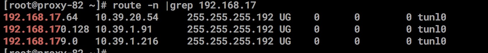
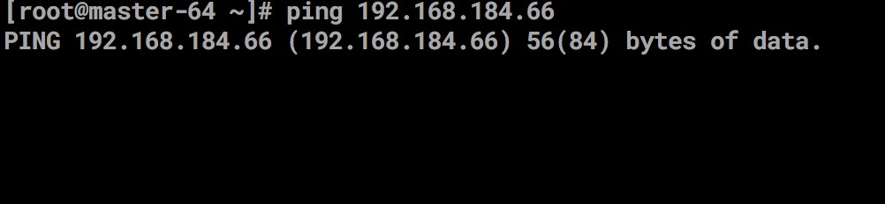

### 问答描述
    1. 添加了一台机器之后导致无法ping通pod 
    问题如下
       pod 的ip地址是 192.168.17.29 
       
       node 的地址是10.39.1.82  
       
       ping 192.168.17.29  

   
   
### 故障解决
    1. 查看node 的路由
   
       
    2. 既然问题出现calico没有及时刷新路由导致，
    
       查看cailico   tun0 的ip 地址为192.168.184.66
       查看集群内所有的pod ip 是否和这个ip 有冲突，
       kubectl get pods --all-namespaces -o wide | grep 192.168.184.66 
       ping tun0 的ip 发现ping 不通 
  
       
       