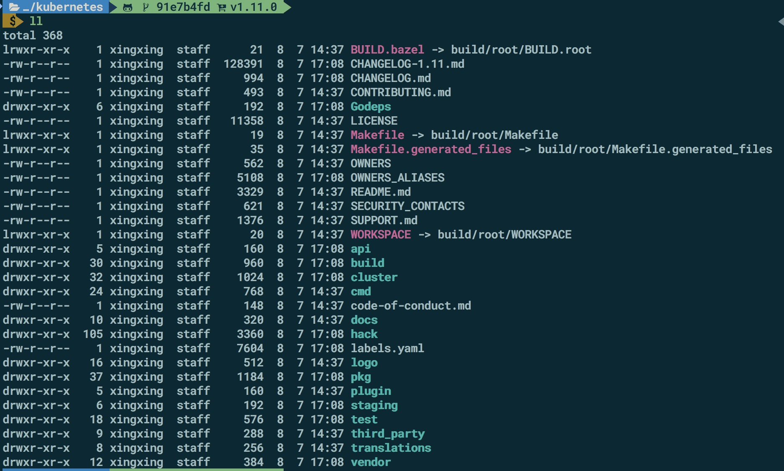
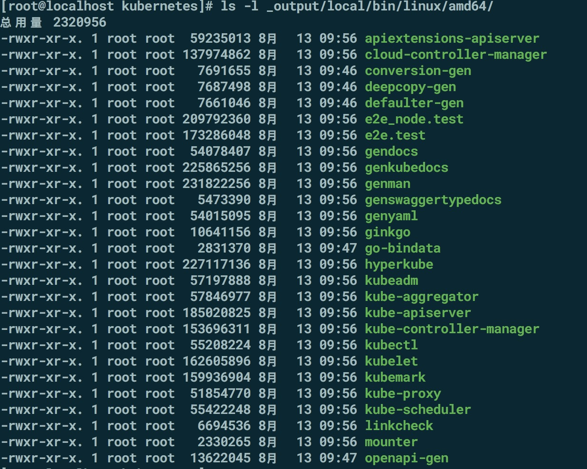
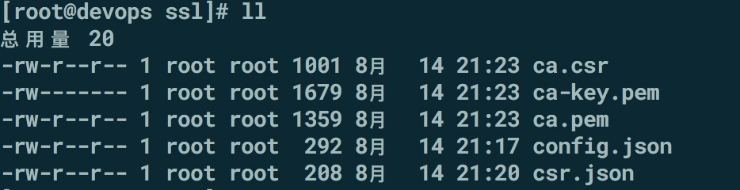
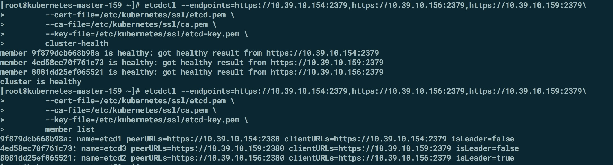

## kubernetes-1.11.0部署之etcd

   
   
   
    参考文档文档编译 
 [https://github.com/kubernetes/kubernetes/tree/release-1.11/cluster/images/hyperkube]()
  
    参考文档文档编译
    
### 环境安装 
    1. docker install
       所有节点都按照docker  
       yum install -y yum-utils   device-mapper-persistent-data   lvm2
       yum-config-manager     --add-repo     https://download.docker.com/linux/centos/docker-ce.repo
       yum list docker-ce --showduplicates | sort -r  
       
       安装docker-ce-17.03.2.ce 不能直接yum安装，需要安装docker-ce-selinux-17.03.2.ce
       wget https://download.docker.com/linux/centos/7/x86_64/stackages/docker-ce-selinux-17.03.2.ce-1.el7.centos.noarch.rpm       
       
       yum install docker-ce-selinux-17.03.2.ce-1.el7.centos.noarch.rpm  docker-ce-17.03.2.ce  -y  

       mkdir /etc/docker/  

       vim /etc/docker/daemon.json 
        
			{
			 "storage-driver": "overlay2",
			 "storage-opts": [
			 "overlay2.override_kernel_check=true"
			 ]
		   }
         
        启动docker  
        systemctl restart docker  
   
   
    2. 安装golang
        10.39.1.43上安装golang 
        wget https://dl.google.com/go/go1.10.3.linux-amd64.tar.gz 
        tar -C /usr/local/ -xzf go1.10.3.linux-amd64.tar.gz  
        vim /etc/profile 
        export PATH=$PATH:/usr/local/go/bin
        
        设置GOROOT  GOPATH 
        export GOROOT=$HOME/go1.
        export PATH=$PATH:$GOROOT/bin 
        cd $GOPATH  &&  mkdir  {pkg,src,bin,lib}
        go  version 
   
    3. kubernetes 编译      
     
       下载kubernetes 源码  
       cd $GOPATH/src 
       git clone https://github.com/kubernetes/kubernetes.git 
       git tag 
       git checkout  v1.11.0  
       git branch -v
       
    4. 编译

       选择本地go编译，编译二进制  
       KUBE_BUILD_PLATFORMS=linux/amd64 make all  
       编译完成后，生成的二进制文件，会生成一个_output 目录
   
       
       
       版本更新说明
   [https://github.com/kubernetes/kubernetes/blob/master/CHANGELOG-1.11.md#v1110]()
   
    5. 机器准备
       三台master， 一台node 
       主机              主机名 
    	10.39.10.160     kubernetes-node-160
		10.39.10.159     kubernetes-master-159(etcd)
		10.39.10.156     kubernetes-master-156(etcd)
		10.39.10.154     kubernetes-master-154(etcd)
		
		添加hosts 
	   系统
	   CentOS Linux release 7.5.1804  3.10.0-862.9.1.el7.x86_64 
	   
	6. 创建证书 
	   
	   使用CloudFlare的pki 工具来生成CA证书
   [https://github.com/cloudflare/cfssl]()
       
       install cfssl 	   
	    mkdir -p /opt/local/cfssl
       cd /opt/local/cfssl

       wget https://pkg.cfssl.org/R1.2/cfssl_linux-amd64
       mv cfssl_linux-amd64 cfssl

       wget https://pkg.cfssl.org/R1.2/cfssljson_linux-amd64
       mv cfssljson_linux-amd64 cfssljson

       wget https://pkg.cfssl.org/R1.2/cfssl-certinfo_linux-amd64
       mv cfssl-certinfo_linux-amd64 cfssl-certinfo

       chmod +x *   	   
    
       创建CA 证书
       mkdir /opt/k8s/ssl
       config.json 文件 
       vim config.json 
       {
         "signing": {
         "default": {
          "expiry": "87600h"
         },
         "profiles": {
           "kubernetes": {
              "usages": [
                 "signing",
                 "key encipherment",
                 "server auth",
                 "client auth"
              ],
            "expiry": "87600h"
          }
         }
      }
     }
       
       
    vim csr.json
       {
       "CN": "kubernetes",
       "key": {
          "algo": "rsa",
          "size": 2048
       },
      "names": [
    {
      "C": "CN",
      "ST": "BeiJing",
      "L": "BeiJing",
      "O": "k8s",
      "OU": "System"
         }
     ]
    } 
     
    生成CA 证书和私钥 
    cfssl gencert -initca  csr.json | cfssljson -bare ca 
    
   
     
    分发证书
     mkdir -p /etc/kubernetes/ssl   拷贝到kubernetes所有机器上
     ansible -i hosts k8s -m shell -a "mkdir /etc/kubernetes/ssl  -p"
     ansible -i hosts  k8s -m copy -a "src=/opt/k8s/ssl  dest=/etc/kubernetes/" 
     
      
         
### etcd 集群
    
      最新的kubernetes v1.11.0 支持的etcd 版本是v3.2.18 版本 
      wget https://github.com/coreos/etcd/releases/download/v3.2.18/etcd-v3.2.18-linux-amd64.tar.gz
      tar zxvf etcd-v3.2.18-linux-amd64.tar.gz
      cd etcd-v3.2.18-linux-amd64
      ansible -i hosts  k8s -m copy -a "src=etcd-v3.2.18-linux-amd64/etcd  dest=/usr/bin/"
      ansible -i hosts  k8s -m copy -a "src=etcd-v3.2.18-linux-amd64/etcdctl  dest=/usr/bin/"
      
     创建etcd证书
     
     cd /opt/k8s/ssl 
     vim etcd-csr.json
       {
        "CN": "etcd",
        "hosts": [
        "127.0.0.1",
        "10.39.10.154",
        "10.39.10.156",
        "10.39.10.159"
         ],
        "key": {
        "algo": "rsa",
        "size": 2048
        },
        "names": [
        {
      "C": "CN",
      "ST": "BeiJing",
      "L": "BeiJing",
      "O": "k8s",
      "OU": "System"
       }
      ]
     }     
     
     生成etcd  
     cfssl gencert -ca=ca.pem  -ca-key=ca-key.pem  -config=config.json   -profile=kubernetes etcd-csr.json | cfssljson -bare etcd 
    
  ![](image/etcd-ssl.p
     
    查看证书
    cfssl-certinfo -cert etcd.pem  
    
    拷贝证书到etcd 服务器
 
#### etcd-1 
     scp  etcd*.pem   root@10.39.10.154:/etc/kubernetes/ssl/ 
     
#### etcd-2 
     scp  etcd*.pem   root@10.39.10.156:/etc/kubernetes/ssl/ 
     
#### etcd-3 
     scp  etcd*.pem   root@10.39.10.159:/etc/kubernetes/ssl/
    
    如果etcd 非root 用户，读取证书会提示没有权限
    chmod 644 /etc/kubernetes/ssl/etcd-key.pem 
   
    ansible -i hosts  etcd -m shell -a "chmod 644 /etc/kubernetes/ssl/etcd-key.pem"
    
### etcd 配置
    
    创建etcd 的数据存储目录，默认是在/var/lib/etcd/
    
    useradd  etcd  
    
    mkdir /data/etcd -p 
    ansible -i hosts  etcd -m shell -a "mkdir /data/etcd -p"
    chown -R etcd:etcd /data/etcd
    
    chmod +x /usr/bin/etcd 
    chmod +x /usr/bin/etcdctl  
        
    
    
#### etcd-1  
    vim  /etc/systemd/system/etcd.service
    [Unit]
    Description=Etcd Server
    After=network.target
    After=network-online.target
    Wants=network-online.target

    [Service]
    Type=notify
    WorkingDirectory=/data/etcd/
    User=etcd
    # set GOMAXPROCS to number of processors
    ExecStart=/usr/bin/etcd \
    --name=etcd1 \
    --cert-file=/etc/kubernetes/ssl/etcd.pem \
    --key-file=/etc/kubernetes/ssl/etcd-key.pem \
    --peer-cert-file=/etc/kubernetes/ssl/etcd.pem \
    --peer-key-file=/etc/kubernetes/ssl/etcd-key.pem \
    --trusted-ca-file=/etc/kubernetes/ssl/ca.pem \
    --peer-trusted-ca-file=/etc/kubernetes/ssl/ca.pem \
    --initial-advertise-peer-urls=https://10.39.10.154:2380 \
    --listen-peer-urls=https://10.39.10.154:2380 \
    --listen-client-urls=https://10.39.10.154:2379,http://127.0.0.1:2379 \
    --advertise-client-urls=https://10.39.10.154:2379 \
    --initial-cluster-token=k8s-etcd-cluster \
    --initial-cluster=etcd1=https://10.39.10.154:2380,etcd2=https://10.39.10.156:2380,etcd3=https://10.39.10.159:2380 \
    --initial-cluster-state=new \
    --data-dir=/data/etcd/
    Restart=on-failure
    RestartSec=5
    LimitNOFILE=65536

    [Install]
    WantedBy=multi-user.target
    
    
#### etcd 2 
     vim  /etc/systemd/system/etcd.service
     [Unit]
     Description=Etcd Server
     After=network.target
     After=network-online.target
     Wants=network-online.target

     [Service]
     Type=notify
     WorkingDirectory=/data/etcd/
     User=etcd
     # set GOMAXPROCS to number of processors
     ExecStart=/usr/bin/etcd \
     --name=etcd2 \
     --cert-file=/etc/kubernetes/ssl/etcd.pem \
     --key-file=/etc/kubernetes/ssl/etcd-key.pem \
     --peer-cert-file=/etc/kubernetes/ssl/etcd.pem \
     --peer-key-file=/etc/kubernetes/ssl/etcd-key.pem \
     --trusted-ca-file=/etc/kubernetes/ssl/ca.pem \
     --peer-trusted-ca-file=/etc/kubernetes/ssl/ca.pem \
     --initial-advertise-peer-urls=https://10.39.10.156:2380 \
     --listen-peer-urls=https://10.39.10.156:2380 \
     --listen-client-urls=https://10.39.10.156:2379,http://127.0.0.1:2379 \
     --advertise-client-urls=https://10.39.10.156:2379 \
     --initial-cluster-token=k8s-etcd-cluster \
     --initial-cluster=etcd1=https://10.39.10.154:2380,etcd2=https://10.39.10.156:2380,etcd3=https://10.39.10.159:2380 \
     --initial-cluster-state=new \
     --data-dir=/data/etcd
     Restart=on-failure
     RestartSec=5
     LimitNOFILE=65536

    [Install]
    WantedBy=multi-user.target
    
    
    
    
#### etcd-3 
    vim /etc/systemd/system/etcd.service  
     [Unit]
     Description=Etcd Server
     After=network.target
     After=network-online.target
     Wants=network-online.target

     [Service]
     Type=notify
     WorkingDirectory=/data/etcd/
     User=etcd
     # set GOMAXPROCS to number of processors
     ExecStart=/usr/bin/etcd \
     --name=etcd3 \
     --cert-file=/etc/kubernetes/ssl/etcd.pem \
     --key-file=/etc/kubernetes/ssl/etcd-key.pem \
     --peer-cert-file=/etc/kubernetes/ssl/etcd.pem \
     --peer-key-file=/etc/kubernetes/ssl/etcd-key.pem \
     --trusted-ca-file=/etc/kubernetes/ssl/ca.pem \
     --peer-trusted-ca-file=/etc/kubernetes/ssl/ca.pem \
     --initial-advertise-peer-urls=https://10.39.10.159:2380 \
     --listen-peer-urls=https://10.39.10.159:2380 \
     --listen-client-urls=https://10.39.10.159:2379,http://127.0.0.1:2379 \
     --advertise-client-urls=https://10.39.10.159:2379 \
     --initial-cluster-token=k8s-etcd-cluster \
     --initial-cluster=etcd1=https://10.39.10.154:2380,etcd2=https://10.39.10.156:2380,etcd3=https://10.39.10.159:2380 \
     --initial-cluster-state=new \
     --data-dir=/data/etcd
     Restart=on-failure
     RestartSec=5
     LimitNOFILE=65536
 
     [Install]
     WantedBy=multi-user.target
         

      
#### 启动etcd 
    systemctl daemon-reload
    systemctl enable etcd
    systemctl start etcd
    systemctl status etcd
 
      
    查看etcd 集群状态 
    etcdctl --endpoints=https://10.39.10.154:2379,https://10.39.10.156:2379,https://10.39.10.159:2379\
        --cert-file=/etc/kubernetes/ssl/etcd.pem \
        --ca-file=/etc/kubernetes/ssl/ca.pem \
        --key-file=/etc/kubernetes/ssl/etcd-key.pem \
        cluster-health
        
    查看etcd 集群成员
     etcdctl --endpoints=https://10.39.10.154:2379,https://10.39.10.156:2379,https://10.39.10.159:2379\
        --cert-file=/etc/kubernetes/ssl/etcd.pem \
        --ca-file=/etc/kubernetes/ssl/ca.pem \
        --key-file=/etc/kubernetes/ssl/etcd-key.pem \
        member list  
        
      
      
    
 	
	
	
	
	
	
		     
     
    