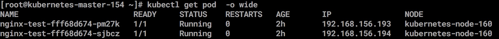
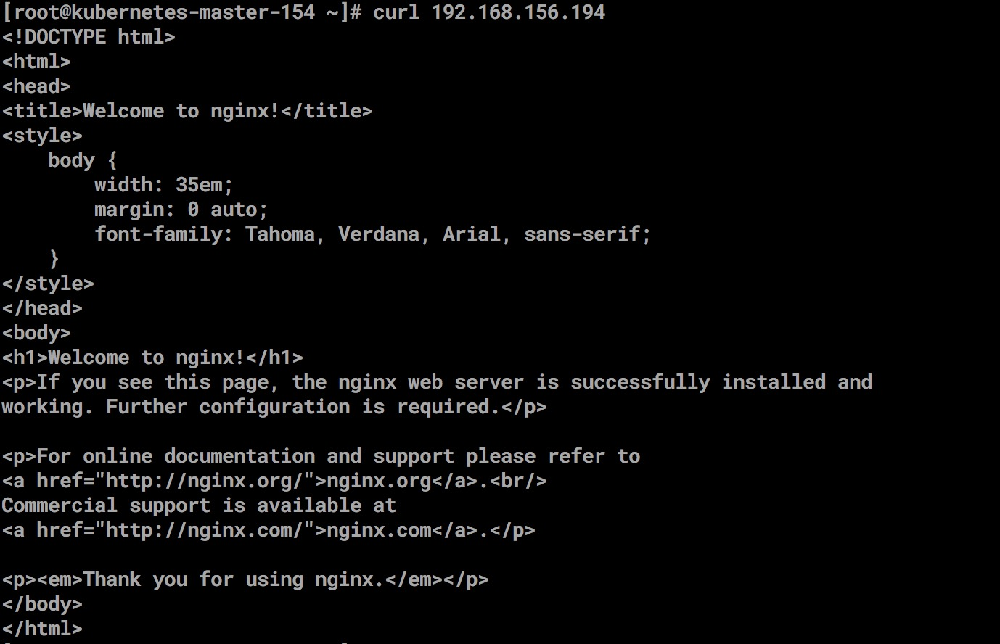
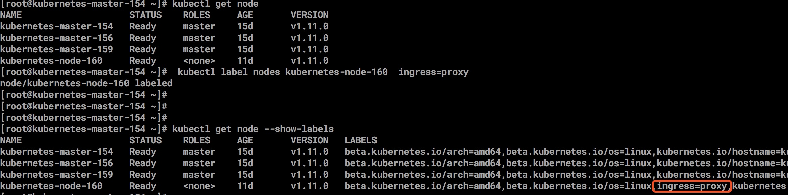
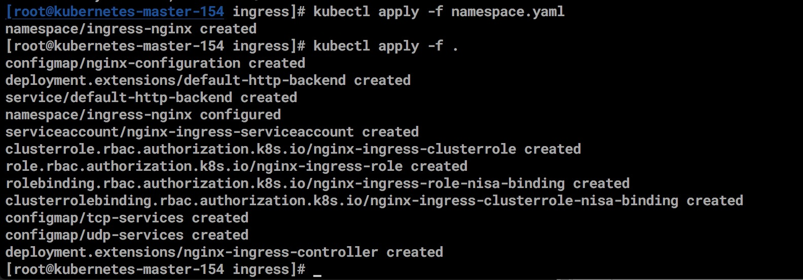
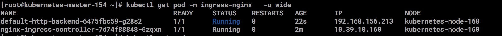

## 部署ingress 

### 验证集群 
    
    创建一个 nginx deplyment
		apiVersion: extensions/v1beta1
		kind: Deployment
		metadata:
		  name: nginx-dm
		spec:
		  replicas: 2
		  template:
		    metadata:
		      labels:
		        name: nginx
		    spec:
		      containers:
		        - name: nginx
		          image: nginx:alpine
		          imagePullPolicy: IfNotPresent
		          ports:
		            - containerPort: 80
		
		---
		
		apiVersion: v1
		kind: Service
		metadata:
		  name: nginx-svc
		spec:
		  ports:
		    - port: 80
		      targetPort: 80
		      protocol: TCP
		  selector:
		    name: nginx
		      
   
   

		    

### 部署Nginx Ingress  
    
    kubernetes暴露服务的方式只有三种 loadBlancer Service、 NodePort Service、 Ingress； 
    什么是Ingress？Ingress 就是利用Nginx Haproxy等负载均衡工具来暴露kubernetes 服务
   [https://github.com/kubernetes/ingress-nginx]()
       
    ingress 有多种方式: 
        1. deployment 自由调度的replicas 
        2. daeminset 全局调度 分配到所有node里 
        
     deployment 自由调度过程中，由于我们需要约束controller 调度到指定的node中，所以需要对node 进行label 标签
     
      为node 打上proxy 标签， 
      
    
    
    下载镜像
    gcr.io/google_containers/defaultbackend:1.4
    quay.io/kubernetes-ingress-controller/nginx-ingress-controller:0.16.2 
    
    下载yaml 文件
    curl -O https://raw.githubusercontent.com/kubernetes/ingress-nginx/master/deploy/namespace.yaml
	curl -O https://raw.githubusercontent.com/kubernetes/ingress-nginx/master/deploy/default-backend.yaml
	curl -O https://raw.githubusercontent.com/kubernetes/ingress-nginx/master/deploy/configmap.yaml
	curl -O https://raw.githubusercontent.com/kubernetes/ingress-nginx/master/deploy/tcp-services-configmap.yaml
	curl -O https://raw.githubusercontent.com/kubernetes/ingress-nginx/master/deploy/udp-services-configmap.yaml

    部署Ingress RBAC 认证 
    curl -O https://raw.githubusercontent.com/kubernetes/ingress-nginx/master/deploy/rbac.yaml
    
    部署Ingress  Controller 组件
    curl -O https://raw.githubusercontent.com/kubernetes/ingress-nginx/master/deploy/with-rbac.yaml
    
    tcp-service 与 udp-service, 由于 ingress 不支持 tcp 与 udp 的转发，所以这里配置了两个基于 tcp 与 udp 的 service ,通过 --tcp-services-configmap 与 --udp-services-configmap 来配置 tcp 与 udp 的转发服务
   
    # tcp 例子
   
	apiVersion: v1
	kind: ConfigMap
	metadata:
	  name: tcp-services
	  namespace: ingress-nginx
	data:
	  9000: "default/tomcat:8080"
	#  以上配置， 转发 tomcat:8080 端口 到 ingress 节点的 9000 端口中
	
	  
	# udp 例子
	apiVersion: v1
	kind: ConfigMap
	metadata:
	  name: udp-services
	  namespace: ingress-nginx
	data:
	  53: "kube-system/kube-dns:53"
    
    替换所有的image 
    
    sed -i 's/gcr\.io\/google_containers/harbor.enncloud.cn\/enncloud\//g' *
    sed -i 's/quay\.io\/kubernetes-ingress-controller/harbor.enncloud.cn\/enncloud\//g' *
    
    修改yaml文件增加rbac认证，hostNetwork 还有nodeSelector，第二个spec 下增加
    vi with-rbac.yaml
    
    
		spec:
		  replicas: 2
		  ....
		    spec:
		      serviceAccountName: nginx-ingress-serviceaccount
		      hostNetwork: true
		      nodeSelector:
		        ingress: proxy
		    ....
		          # 这里添加一个 other 端口做为后续tcp转发
		          ports:
		          - name: http
		            containerPort: 80
		          - name: https
		            containerPort: 443
		          - name: other
		            containerPort: 8888
	
	导入yaml 文件
    kubectl apply -f namespace.yaml  
     kubectl apply -f . 
   
   
    查看服务
   
   
    创建一个机遇nginx-web 的ingress  
    
    vim  nginx-ingress.yaml  
        apiVersion: extensions/v1beta1
			kind: Ingress
			metadata:
			  name: nginx-ingress
			spec:
			  rules:
			  - host: nginx.xingxingwang.io
			    http:
			      paths:
			      - backend:
			          serviceName: nginx-svc
			          servicePort: 80
   
    需要把nginx.xingxingwang.io 域名解析到对应node 的外网ip上就可以访问了
    
### 部署heapster  
     
    wget https://raw.githubusercontent.com/kubernetes/heapster/master/deploy/kube-config/influxdb/grafana.yaml
	wget https://raw.githubusercontent.com/kubernetes/heapster/master/deploy/kube-config/influxdb/influxdb.yaml
	wget https://raw.githubusercontent.com/kubernetes/heapster/master/deploy/kube-config/influxdb/heapster.yaml
	wget https://raw.githubusercontent.com/kubernetes/heapster/master/deploy/kube-config/rbac/heapster-rbac.yaml
   
   
   
    
    
    
    
    
    
    
    
    
    
    
    
    
    
    
     
