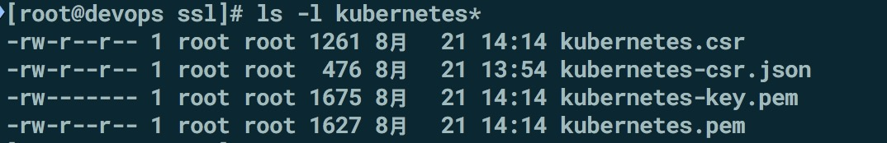
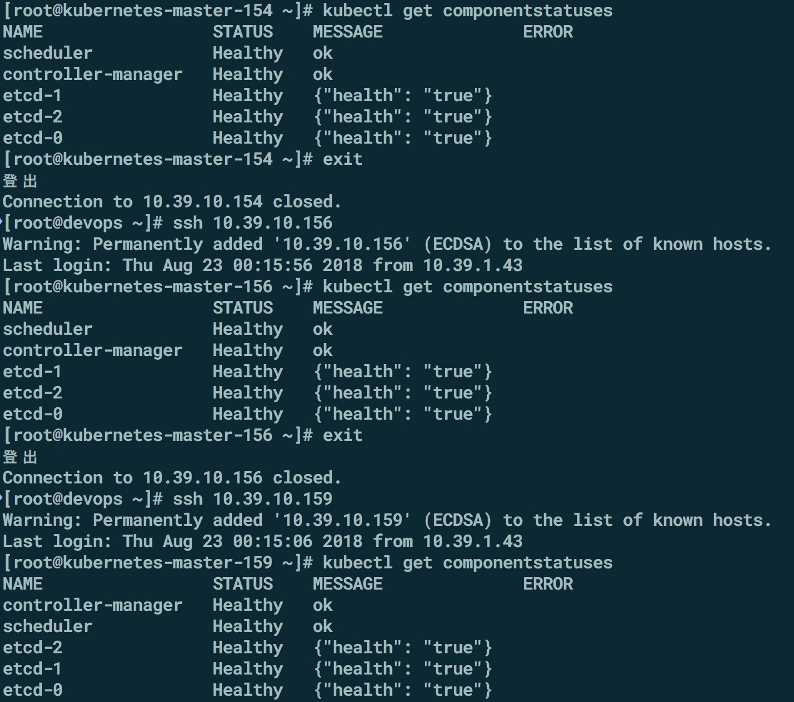
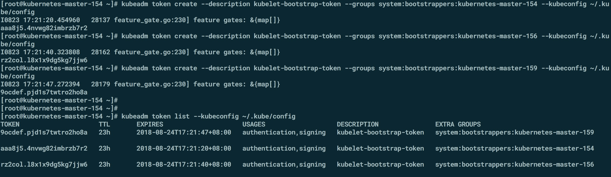

## kubernetes-1.11.0集群部署之master集群 (二)

### Master 
    
    master 的组件有以下: 
    
    1. API Server
       Api server提供HTTP/HTTPS RESTful  API,既kubernetes API,API server 是kubernetes Cluster的前端接口，各种客户端工具(CLI或UI)以及kubernetes其他组件可以通过它管理cluster各种资源
   
    2. Scheduler(kube-scheduler)
       scheduler 负责决定Pod放在哪个node 上运行.scheduler 在调度时会充分考虑cluster 的拓扑结构，当前各个节点的负载，以及应用对高可用、性能、数据亲和性的需求. 
     
    3. Controller Manager(kube-controller-manager)      
       Controller Manager 负责管理CLuster 各种资源，保障资源处于预期的状态，Controller Manager 由多种controller 组成，包括replication  controller、endpoints  controller 、namespace controller、serviceaccounts controller 等。
         
      不同的controller 管理不同的资源，例如,replication controller管理Deployment、SatefulSet、DaemonSet 的生命周期,namespace controller 管理namespace 资源
      	
    4. etcd 
       etcd负责保存kubernetes Cluster的配置信息和各种资源的状态信息.当数据发生变化时，etcd快速通知kubernetes 相关组件
    
    5.Pod 
      Pod 要能够相互通信，kubernetes Cluster 必须部署Pod 网络，网络组件可选择fannel calico  
      (kubectl 安装在所有需要进行操作的机器上）
    
    6.master 需要安装的组建
    kube-apiserver，kube-controller-manager，kube-scheduler，kubectl，kubelet，kubeadm

    
#### 安装组件
    将之前编译好的二进制文件,kube-apiserver，kube-controller-manager，kube-scheduler，kubectl，kubelet，kubeadm 拷贝到/usr/local/bin/  所有master 进行同步
    
    创建admin 证书
    kubectl 与 kube-apiserver 的安全端口通信，需要为安全通信提供TLS 证书和秘钥
    
    vim  admin-csr.json
      {
        "CN": "admin",
        "hosts": [],
        "key": {
        "algo": "rsa",
        "size": 2048
        },
      "names": [
      {
       "C": "CN",
       "ST": "BeiJing",
       "L": "BeiJing",
       "O": "system:masters",
       "OU": "System"
       }
      ]
     }
    
    生成admin 证书和秘钥
    cd /opt/ssl/ 
       cfssl gencert -ca=ca.pem  -ca-key=ca-key.pem  -config=config.json  -profile=kubernetes admin-csr.json | cfssljson -bare admin 
     
    证书拷贝到master 的机器上，154，156.159  
    scp ssl/admin*   root@10.39.10.154:/etc/kubernetes/ssl/ 
    ...........
    
    
#### 生成kubernetes配置文件
    #生成证书相关配置文件存储于/root/.kube 目录中
    
    配置kubernetes 集群
    
    在10.39.10.154 这台机器上操作
    kubectl config   set-cluster   kubernetes   --certificate-authority=/etc/kubernetes/ssl/ca.pem  --embed-certs=true   --server=https://127.0.0.1:6443 
    
    
    配置客户端认证
    kubectl config set-credentials  admin  --client-certificate=/etc/kubernetes/ssl/admin.pem  --embed-certs=true  --client-key=/etc/kubernetes/ssl/admin-key.pem 
    
    kubectl config set-context kubernetes \
    --cluster=kubernetes \
    --user=admin
  
  
    kubectl config use-context kubernetes
    
#### 创建kubernetes 证书 
    vim kubernetes-csr.json 
     {
      "CN": "kubernetes",
      "hosts": [
      "127.0.0.1",
      "10.39.10.154",
      "10.39.10.156",
      "10.39.10.159",
      "10.254.0.1",
      "kubernetes",
      "kubernetes.default",
      "kubernetes.default.svc",
      "kubernetes.default.svc.cluster",
      "kubernetes.default.svc.cluster.local"
        ],
       "key": {
       "algo": "rsa",
       "size": 2048
       },
       "names": [
       {
         "C": "CN",
         "ST": "BeiJing",
         "L": "BeiJing",
         "O": "k8s",
         "OU": "System"
         }
        ]
      } 
   
    # 这里 hosts 字段中 三个 IP 分别为 127.0.0.1 本机，10.39.10.154 和 10.39.10.156，10.39.10.159 为 Master 的IP，多个Master需要写多个。  10.254.0.1 为 kubernetes SVC 的 IP， 一般是 部署网络的第一个IP , 如: 10.254.0.1 ， 在启动完成后，我们使用   kubectl get svc ， 就可以查看到 
    
    
    
    生成kubernetes 证书和私钥 
    cfssl gencert -ca=ca.pem  -ca-key=ca-key.pem  -config=config.json  -profile=kubernetes   kubernetes-csr.json | cfssljson  -bare kubernetes
    
   
   
    拷贝kubernetes*.pem  /etc/kubernetes/ssl/     
    scp kubernetes*.pem root@10.39.10.154:/etc/kubernetes/ssl/
    ........
    
    
#### 配置kube-apiserver     
    [root@devops ssl]# head -c 16 /dev/urandom  | od -An -t x | tr -d ' '
    da4090c6baadef99e577a9ac5da6f684
    创建encryption-config.yaml 配置
     cat > encryption-config.yaml <<EOF
		kind: EncryptionConfig
		apiVersion: v1
		resources:
		   - resources:
      		- secrets
    providers:
      - aescbc:
          keys:
            - name: key1
              secret: 40179b02a8f6da07d90392ae966f7749
      - identity: {}
    EOF
 
    #拷贝
    scp encryption-config.yaml root@10.39.10.154:/etc/kubernetes/  
    .......  
    
    #生成高级审核配置文件 
 [https://kubernetes.io/docs/tasks/debug-application-cluster/audit/]()
     
     cat >> audit-policy.yaml <<EOF
		# Log all requests at the Metadata level.
		apiVersion: audit.k8s.io/v1beta1
		kind: Policy
	   rules:
       - level: Metadata
     EOF 
    拷贝到所有master 机器上
    scp audit-policy.yaml   root@10.39.10.154:/etc/kubernetes/    
    创建kube-apiserver.service 文件
    # 自定义系统
    # master 机器上都需要配置
    vi /etc/systemd/system/kube-apiserver.service
    
    [Unit]
	 Description=Kubernetes API Server
	 Documentation=https://github.com/GoogleCloudPlatform/kubernetes
    After=network.target

    [Service]
    User=root
    ExecStart=/usr/local/bin/kube-apiserver \
    --admission-control=NamespaceLifecycle,LimitRanger,ServiceAccount,DefaultStorageClass,ResourceQuota,NodeRestriction \
    --anonymous-auth=false \
    --experimental-encryption-provider-config=/etc/kubernetes/encryption-config.yaml \
    --advertise-address=10.39.10.154 \
    --allow-privileged=true \
    --apiserver-count=3 \
    --audit-policy-file=/etc/kubernetes/audit-policy.yaml \
    --audit-log-maxage=30 \
    --audit-log-maxbackup=3 \
    --audit-log-maxsize=100 \
    --audit-log-path=/var/log/kubernetes/audit.log \
    --authorization-mode=Node,RBAC \
    --bind-address=0.0.0.0 \
    --secure-port=6443 \
    --client-ca-file=/etc/kubernetes/ssl/ca.pem \
    --kubelet-client-certificate=/etc/kubernetes/ssl/kubernetes.pem \
    --kubelet-client-key=/etc/kubernetes/ssl/kubernetes-key.pem \
    --enable-swagger-ui=true \
    --etcd-cafile=/etc/kubernetes/ssl/ca.pem \
    --etcd-certfile=/etc/kubernetes/ssl/etcd.pem \
    --etcd-keyfile=/etc/kubernetes/ssl/etcd-key.pem \
    --etcd-servers=https://10.39.10.154:2379,https://10.39.10.156:2379,https://10.39.10.159:2379 \
    --event-ttl=1h \
    --kubelet-https=true \
    --insecure-bind-address=127.0.0.1 \
    --insecure-port=8080 \
    --service-account-key-file=/etc/kubernetes/ssl/ca-key.pem \
    --service-cluster-ip-range=10.254.0.0/18 \
    --service-node-port-range=30000-32000 \
    --tls-cert-file=/etc/kubernetes/ssl/kubernetes.pem \
    --tls-private-key-file=/etc/kubernetes/ssl/kubernetes-key.pem \
    --enable-bootstrap-token-auth \
    --v=1
    Restart=on-failure
    RestartSec=5
    Type=notify
    LimitNOFILE=65536

    
#### 启动kube-apiserver
    systemctl daemon-reload
    systemctl enable kube-apiserver
    systemctl start kube-apiserver
    systemctl status kube-apiserver        
#### 配置kube-controller-manager
    
    vim /etc/systemd/system/kube-controller-manager.service
       [Unit]
       Description=Kubernetes Controller Manager
       Documentation=https://github.com/GoogleCloudPlatform/kubernetes

       [Service]
		ExecStart=/usr/local/bin/kube-controller-manager \
		--address=0.0.0.0 \
		--master=http://127.0.0.1:8080 \
		--allocate-node-cidrs=true \
		--service-cluster-ip-range=10.254.0.0/18 \
       --cluster-cidr=10.254.64.0/18 \
       --cluster-signing-cert-file=/etc/kubernetes/ssl/ca.pem \
       --cluster-signing-key-file=/etc/kubernetes/ssl/ca-key.pem \
       --feature-gates=RotateKubeletServerCertificate=true \
       --controllers=*,tokencleaner,bootstrapsigner \
       --experimental-cluster-signing-duration=86700h0m0s \
       --cluster-name=kubernetes \
       --service-account-private-key-file=/etc/kubernetes/ssl/ca-key.pem \
       --root-ca-file=/etc/kubernetes/ssl/ca.pem \
       --leader-elect=true \
       --node-monitor-grace-period=40s \
       --node-monitor-period=5s \
       --pod-eviction-timeout=5m0s \
       --v=2
		Restart=on-failure
		RestartSec=5

		[Install]
		WantedBy=multi-user.target
#### 启动kube-controller-manager 
      
      systemctl daemon-reload
      systemctl enable kube-controller-manager
      systemctl start kube-controller-manager
      systemctl status kube-controller-manager
#### 配置kube-scheduler    
    
    vi /etc/systemd/system/kube-scheduler.service  
      [Unit]
		Description=Kubernetes Scheduler
       Documentation=https://github.com/GoogleCloudPlatform/kubernetes
 
     [Service]
     ExecStart=/usr/local/bin/kube-scheduler \
     --address=0.0.0.0 \
     --master=http://127.0.0.1:8080 \
     --leader-elect=true \
     --v=1
     Restart=on-failure
     RestartSec=5

     [Install]
     WantedBy=multi-user.target  
#### 启动kube-scheduler
     
     systemctl daemon-reload
     systemctl enable kube-scheduler
     systemctl start kube-scheduler
     systemctl status kube-scheduler    
#### 验证master 节点
     
    每台master 上执行kubectl get componentstatuses 
     
   
    
#### 配置 kubelet 认证
   
     kubelet 授权 kube-apiserver 的一些操作 exec run logs 等
     # RBAC 只需创建一次就可以
     kubectl create clusterrolebinding kube-apiserver:kubelet-apis --clusterrole=system:kubelet-api-admin --user kubernetes
   
#### 创建 bootstrap kubeconfig 文件    
     
    #注意: token 生效时间为 1day , 超过时间未创建自动失效，需要重新创建 token 
    # 创建 集群所有 kubelet 的 token
    在master 上执行
    kubeadm token create --description kubelet-bootstrap-token --groups system:bootstrappers:kubernetes-master-154 --kubeconfig ~/.kube/config 
    
    kubeadm token create --description kubelet-bootstrap-token --groups system:bootstrappers:kubernetes-master-156 --kubeconfig ~/.kube/config
     
     kubeadm token create --description kubelet-bootstrap-token --groups system:bootstrappers:kubernetes-master-159 --kubeconfig ~/.kube/config
    # 查看生成的token  
    kubeadm token list --kubeconfig ~/.kube/config 

     
    
#### 以下为了区分会先生成node名称加bootstrap.kubeconfig 
     生成kubernetes-master-154 bootstrap.kubeconfig
     kubectl config set-cluster kubernetes   --certificate-authority=/etc/kubernetes/ssl/ca.pem  --embed-certs=true  --server=https://127.0.0.1:6443 --kubeconfig=kubernetes-master-154-bootstrap.kubeconfig
     
     #配置客户端认证
     kubectl config set-credentials  kubelet-bootstrap  --token=aaa8j5.4nvwg82imbrzb7r2   --kubeconfig=kubernetes-master-154-bootstrap.kubeconfig

     #配置关联
    kubectl config set-context default  --cluster=kubernetes  --user=kubelet-bootstrap  --kubeconfig=kubernetes-master-154-bootstrap.kubeconfig
      
     #配置默认关键
     kubectl config use-context default  --kubeconfig=kubernetes-master-154-bootstrap.kubeconfig
     
     拷贝生成的kubernetes-master-154-bootstrap.kubeconfig 文件
     mv kubernetes-master-154-bootstrap.kubeconfig  /etc/kubernetes/bootstrap.kubeconfig
     
     生成kubernetes-master-156 bootstrap.kubeconfig    
     kubectl config set-cluster kubernetes  --certificate-authority=/etc/kubernetes/ssl/ca.pem --embed-certs=true  --server=https://127.0.0.1:6443   --kubeconfig=kubernetes-master-156-bootstrap.kubeconfig

    #配置客户端认证
     kubectl config set-credentials kubelet-bootstrap   --token=rz2col.l8x1x9dg5kg7jjw6  --kubeconfig=kubernetes-master-156-bootstrap.kubeconfig
     
    #配置关联
    kubectl config set-context default \
     --cluster=kubernetes \
     --user=kubelet-bootstrap \
     --kubeconfig=kubernetes-master-156-bootstrap.kubeconfig
    
    #配置默认关联
    kubectl config use-context default --kubeconfig=kubernetes-master-156-bootstrap.kubeconfig
    
    #拷贝生成的kubernetes-master-156-bootstrap.kubeconfig  
     mv kubernetes-master-156-bootstrap.kubeconfig  /etc/kubernetes/bootstrap.kubeconfig
     
    # 生成159的bootstrap.kubeconfig  
    
    #配置集群参数
    kubectl config set-cluster kubernetes \
    --certificate-authority=/etc/kubernetes/ssl/ca.pem \
    --embed-certs=true \
    --server=https://127.0.0.1:6443 \
    --kubeconfig=kubernetes-master-159-bootstrap.kubeconfig 
    
    #配置客户端认证
    kubectl config set-credentials kubelet-bootstrap \
    --token=9ocdef.pjd1s7twtro2ho8a \
    --kubeconfig=kubernetes-master-159-bootstrap.kubeconfig
    
    
    #配置关联
    kubectl config set-context default \
    --cluster=kubernetes \
    --user=kubelet-bootstrap \
     --kubeconfig=kubernetes-master-159-bootstrap.kubeconfig
    

    #配置默认关联
    kubectl config use-context default --kubeconfig=kubernetes-master-159-bootstrap.kubeconfig
    
    #拷贝生成
     mv kubernetes-master-159-bootstrap.kubeconfig  /etc/kubernetes/bootstrap.kubeconfig 
     
#### 配置bootstrap RBAC 权限

    kubectl create clusterrolebinding kubelet-bootstrap --clusterrole=system:node-bootstrapper --group=system:bootstrappers

#### 创建自动批准相关CSR请求ClusterRole 

    vim /etc/kubernetes/tls-instructs-csr.yaml 
    
     kind: ClusterRole
     apiVersion: rbac.authorization.k8s.io/v1
     metadata:
     name: system:certificates.k8s.io:certificatesigningrequests:selfnodeserver
     rules:
     - apiGroups: ["certificates.k8s.io"]
       resources: ["certificatesigningrequests/selfnodeserver"]
      verbs: ["create"]

     #导入yaml 文件
     kubectl apply -f /etc/kubernetes/tls-instructs-csr.yaml 

     #查看  
     kubectl describe ClusterRole/system:certificates.k8s.io:certificatesigningrequests:selfnodeserver 
     
     #将ClusterRole 绑定到适当的用户组
     #自动批准 system:bootstrappers 组用户 TLS bootstrapping 首次申请证书的 CSR 请求
      
      kubectl create clusterrolebinding node-client-auto-approve-csr --clusterrole=system:certificates.k8s.io:certificatesigningrequests:nodeclient --group=system:bootstrappers
      
     #自动批准 system:nodes 组用户更新 kubelet 自身与 apiserver 通讯证书的 CSR 请求
      
      kubectl create clusterrolebinding node-client-auto-renew-crt --clusterrole=system:certificates.k8s.io:certificatesigningrequests:selfnodeclient --group=system:nodes  
      
    #自动批准 system:nodes 组用户更新 kubelet 10250 api 端口证书的 CSR 请求
     
     kubectl create clusterrolebinding node-server-auto-renew-crt --clusterrole=system:certificates.k8s.io:certificatesigningrequests:selfnodeserver --group=system:nodes

### 创建 kubelet.service 文件 
    
    关于kubectl get  node 中的ROLES 的标签
    单 Master 打标签 kubectl label node kubernetes-master-154   node-role.kubernetes.io/master=''    
    这里需要将 单Master 更改为 NoSchedule
    更新标签命令为 kubectl taint nodes kubernetes-64 node-role.kubernetes.io/master=:NoSchedule
    既 Master 又是 node 打标签 kubectl label node kubernetes-65 node-role.kubernetes.io/master=””
    单 Node 打标签 kubectl label node kubernetes-66 node-role.kubernetes.io/node=””
    关于删除 label 可使用 - 号相连 如: kubectl label nodes kubernetes-65 node-role.kubernetes.io/node-
 
     #创建kubelet.service
     vi /etc/systemd/system/kubelet.service 
     [Unit]
     Description=Kubernetes Kubelet
     Documentation=https://github.com/GoogleCloudPlatform/kubernetes
     After=docker.service
     Requires=docker.service

     [Service]
     WorkingDirectory=/var/lib/kubelet
     ExecStart=/usr/local/bin/kubelet \
     --hostname-override=kubernetes-master-154 \
     --pod-infra-container-image=jicki/pause-amd64:3.1 \
     --bootstrap-kubeconfig=/etc/kubernetes/bootstrap.kubeconfig \
     --kubeconfig=/etc/kubernetes/kubelet.kubeconfig \
     --config=/etc/kubernetes/kubelet.config.json \
     --cert-dir=/etc/kubernetes/ssl \
     --logtostderr=true \
     --v=2

    [Install]
    WantedBy=multi-user.target
          
     
    # 创建 kubelet config 配置文件
    vi /etc/kubernetes/kubelet.config.json

      {
      "kind": "KubeletConfiguration",
      "apiVersion": "kubelet.config.k8s.io/v1beta1",
      "authentication": {
        "x509": {
          "clientCAFile": "/etc/kubernetes/ssl/ca.pem"
      },
    "webhook": {
      "enabled": true,
      "cacheTTL": "2m0s"
    },
    "anonymous": {
      "enabled": false
    }
    },
    "authorization": {
    "mode": "Webhook",
    "webhook": {
      "cacheAuthorizedTTL": "5m0s",
      "cacheUnauthorizedTTL": "30s"
    }
    },
    "address": "10.39.10.154",
    "port": 10250,
    "readOnlyPort": 0,
    "cgroupDriver": "cgroupfs",
    "hairpinMode": "promiscuous-bridge",
    "serializeImagePulls": false,
    "RotateCertificates": true,
    "featureGates": {
     "RotateKubeletClientCertificate": true,
     "RotateKubeletServerCertificate": true
    },
    "MaxPods": "512",
    "failSwapOn": false,
    "containerLogMaxSize": "10Mi",
    "containerLogMaxFiles": 5,
    "clusterDomain": "cluster.local.",
    "clusterDNS": ["10.254.0.2"]
    }  
       
  
#### 启动kubelet 
     
     systemctl daemon-reload
	  systemctl enable kubelet
     systemctl start kubelet
     systemctl status kubelet
      
 
#### 总结一下
     
    master 安装的有
    systemctl status kubelet 
    systemctl status kube-scheduler 
    systemctl status kube-controller-manager
    systemctl status kube-apiserver

     
	
	
	
	
	
	
		     
     
    