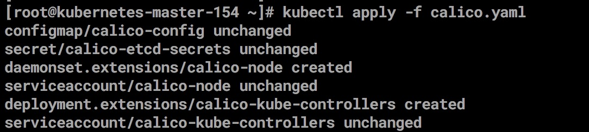

## kubernetes-1.11.0集群部署之node集群 (三)    
#### Node 配置     
     单Node 部分需要部署的组建有docker，calico，kubelet，kube-proxy这几个组件。Node 节点基于nginx 负载API 做Master  HA
    在每个node 上启动一个nginx，每个nginx 反向代理所有的api  server；
    node 上kubelet kube-proxy 连接本地的nginx 代理端口
    当nginx 发现无法链接后端时会自动剔除有问题的api server，从而实现api  server  的HA。
    
    创建kebe-proxy 证书
    vim  kube-proxy-csr.json
        
        {
      "CN": "system:kube-proxy",
      "hosts": [],
      "key": {
          "algo": "rsa",
          "size": 2048
       },
      "names": [
       {
          "C": "CN",
          "ST": "BeiJing",
          "L": "BeiJing",
          "O": "k8s",
          "OU": "System"
        }
      ]
    }
         
    
    生成kube-proxy 证书和私钥 
    cfssl gencert -ca=ca.pem  -ca-key=ca-key.pem  -config=config.json  -profile=kubernetes  kube-proxy-csr.json | cfssljson -bare kube-proxy   
   
   
    
    拷贝到目录
    scp kube-proxy*  root@10.39.10.160:/etc/kubernetes/ssl/
        
#### 创建kube-proxy kubeconfig 文件
     
    
    #配置集群
    kubectl config set-cluster kubernetes  --certificate-authority=/etc/kubernetes/ssl/ca.pem  --embed-certs=true --server=https://127.0.0.1:6443  --kubeconfig=kube-proxy.kubeconfig
    
    #配置客户端认证
    kubectl config set-credentials kube-proxy --client-certificate=/etc/kubernetes/ssl/kube-proxy.pem --client-key=/etc/kubernetes/ssl/kube-proxy-key.pem --embed-certs=true --kubeconfig=kube-proxy.kubeconfig
    
    #配置关联
    kubectl config set-context default --cluster=kubernetes --user=kube-proxy  --kubeconfig=kube-proxy.kubeconfig
    
    #配置默认关联
    kubectl config use-context default --kubeconfig=kube-proxy.kubeconfig
    
          
    #拷贝到其他机器
    scp kube-proxy.kubeconfig root@10.39.10.156:/etc/kubernetes/
    scp kube-proxy.kubeconfig root@10.39.10.159:/etc/kubernetes/
    
   
    #创建kube-proxy.service 文件
     需要安装ipvsadm  ipset conntrack软件 
     yum install ipset ipvsadm conntrack-tools.x86_64 -y
    cd /etc/kubernetes/ 
    
    vim  kube-proxy.config.yaml 
         apiVersion: kubeproxy.config.k8s.io/v1alpha1
		  bindAddress: 10.39.10.160
         clientConnection:
           kubeconfig: /etc/kubernetes/kube-proxy.kubeconfig
         clusterCIDR: 10.254.64.0/18
         healthzBindAddress: 10.39.10.160:10256
         hostnameOverride: kubernetes-master-154
         kind: KubeProxyConfiguration
         metricsBindAddress: 10.39.10.160:10249
         mode: "ipvs"
      
    
    vi /etc/systemd/system/kube-proxy.service
       [Unit]
		Description=Kubernetes Kube-Proxy Server
		Documentation=https://github.com/GoogleCloudPlatform/kubernetes
		After=network.target

		[Service]
		WorkingDirectory=/var/lib/kube-proxy
		ExecStart=/usr/local/bin/kube-proxy \
		 --config=/etc/kubernetes/kube-proxy.config.yaml \
		 --logtostderr=true \
       --v=1     
      Restart=on-failure

      RestartSec=5
      LimitNOFILE=65536

      [Install]
      WantedBy=multi-user.target   
        
       
      这个目录/var/lib/kube-proxy 启动的如果失败请手动创建 
#### 启动kube-proxy
     
     systemctl daemon-reload
	  systemctl enable kube-proxy
     systemctl start kube-proxy
     systemctl status kube-proxy

     # 发布证书
     scp ca.pem kube-proxy.pem  kube-proxy-key.pem root@10.39.10.160:/etc/kubernetes/ssl/ 
     
     创建nginx 代理
     
     yum  install epel-release  -y  
     yum  install nginx -y 
     
     cat << EOF >> /etc/nginx/nginx.conf
			error_log stderr notice;

			worker_processes auto;
			events {
			   multi_accept on;
			   use epoll;
			   worker_connections 1024;
			   }
	
	stream {
    upstream kube_apiserver {
        least_conn;
        server 10.39.10.154:6443;
        server 10.39.10.156:6443;
        server 10.39.10.159:6443;
    }

    server {
        listen      0.0.0.0:6443;
        proxy_pass    kube_apiserver;
        proxy_timeout 10m;
        proxy_connect_timeout 1s;
        }
      }
    EOF
     
     
    # 配置nginx 基于docker 进程，然后配置systemd来启动
   
     vim /etc/systemd/system/nginx-proxy.service    
     [Unit]
     Description=kubernetes apiserver docker wrapper
     Wants=docker.socket
     After=docker.service

    [Service]
    User=root
    PermissionsStartOnly=true
    ExecStart=/usr/bin/docker run -p 127.0.0.1:6443:6443 \
                              -v /etc/nginx:/etc/nginx \
                              --name nginx-proxy \
                              --net=host \
                              --restart=on-failure:5 \
                              --memory=512M \
                              nginx:1.13.7-alpine
    ExecStartPre=-/usr/bin/docker rm -f nginx-proxy
    ExecStop=/usr/bin/docker stop nginx-proxy
    Restart=always
    RestartSec=15s
    TimeoutStartSec=30s

    [Install]
    WantedBy=multi-user.target
 
    # 启动nginx
    systemctl daemon-reload
	 systemctl start nginx-proxy
    systemctl enable nginx-proxy
    systemctl status nginx-proxy
    
          
#### 配置kubelet.service 文件
    vi /etc/systemd/system/kubelet.service
       [Unit]
	    Description=Kubernetes Kubelet
       Documentation=https://github.com/GoogleCloudPlatform/kubernetes
       After=docker.service
       Requires=docker.service

      [Service]
      WorkingDirectory=/var/lib/kubelet
      ExecStart=/usr/local/bin/kubelet \
        --hostname-override=kubernetes-64 \
        --pod-infra-container-image=harbor.enncloud.cn/enncloud/pause-amd64:3.1 \
        --bootstrap-kubeconfig=/etc/kubernetes/bootstrap.kubeconfig \
        --kubeconfig=/etc/kubernetes/kubelet.kubeconfig \
        --config=/etc/kubernetes/kubelet.config.json \
        --cert-dir=/etc/kubernetes/ssl \
        --logtostderr=true \
        --v=2

     [Install]
     WantedBy=multi-user.target
    
   
    #创建kubelet config 配置文件
     {
		  "kind": "KubeletConfiguration",
		  "apiVersion": "kubelet.config.k8s.io/v1beta1",
		  "authentication": {
		    "x509": {
		      "clientCAFile": "/etc/kubernetes/ssl/ca.pem"
		    },
		    "webhook": {
		      "enabled": true,
		      "cacheTTL": "2m0s"
		    },
		    "anonymous": {
		      "enabled": false
		    }
		  },
		  "authorization": {
		    "mode": "Webhook",
		    "webhook": {
		      "cacheAuthorizedTTL": "5m0s",
		      "cacheUnauthorizedTTL": "30s"
		    }
		  },
		  "address": "172.16.1.66",
		  "port": 10250,
		  "readOnlyPort": 0,
		  "cgroupDriver": "cgroupfs",
		  "hairpinMode": "promiscuous-bridge",
		  "serializeImagePulls": false,
		  "featureGates": {
		    "RotateKubeletClientCertificate": true,
		    "RotateKubeletServerCertificate": true
		  },
		  "MaxPods": "512",
		  "failSwapOn": false,
		  "containerLogMaxSize": "10Mi",
		  "containerLogMaxFiles": 5,
		  "clusterDomain": "cluster.local.",
		  "clusterDNS": ["10.254.0.2"]
		}    
      
    #添加node的token(master操作)  
      kubeadm token create --description kubelet-bootstrap-token --groups system:bootstrappers:kubernetes-node-160 --kubeconfig ~/.kube/config
     
     #配置集群参数
     kubectl config set-cluster kubernetes   --certificate-authority=/etc/kubernetes/ssl/ca.pem  --embed-certs=true  --server=https://127.0.0.1:6443 --kubeconfig=kubernetes-node-160-bootstrap.kubeconfig

    #配置客户端认证
    kubectl config set-credentials  kubelet-bootstrap  --token=ap4lcp.3yai1to1f98sfray   --kubeconfig=kubernetes-node-160-bootstrap.kubeconfig

    #配置关键
    kubectl config set-context default  --cluster=kubernetes  --user=kubelet-bootstrap  --kubeconfig=kubernetes-node-160-bootstrap.kubeconfig

    #配置默认关联
     kubectl config use-context default  --kubeconfig=kubernetes-node-160-bootstrap.kubeconfig
    
    拷贝scp kubernetes-node-160-bootstrap.kubeconfig root@10.39.10.160:/etc/kubernetes/bootstrap.kubeconfig  
    
    
     systemctl    restart  kubelet   
     
    ## 如果注册master失败，因为配置写错或者其他原因，需要重新注册的，需要删除原有的一些文件，比如
    /etc/kubernetes/ssl 目录下删除kubelet相关的证书和key, 删除/etc/kubernetes下的     kubelet.kubeconfig 文件, 重新启动kubelet 即可，重新生成这些文件
    
    #配置kube-proxy.service 
     vim /etc/kubernetes/kube-proxy.config.yaml 
          apiVersion: kubeproxy.config.k8s.io/v1alpha1
			bindAddress: 10.39.10.160
			clientConnection:
			  kubeconfig: /etc/kubernetes/kube-proxy.kubeconfig
			clusterCIDR: 10.254.64.0/18
			healthzBindAddress: 10.39.10.160:10256
			hostnameOverride: kubernetes-node-160
			kind: KubeProxyConfiguration
			metricsBindAddress: 10.39.10.160:10249
			mode: "ipvs"  
     
    #创建kube-proxy目录 
       [Unit]
		Description=Kubernetes Kube-Proxy Server
		Documentation=https://github.com/GoogleCloudPlatform/kubernetes
		After=network.target
		
		[Service]
		WorkingDirectory=/var/lib/kube-proxy
		ExecStart=/usr/local/bin/kube-proxy \
		  --config=/etc/kubernetes/kube-proxy.config.yaml \
		  --logtostderr=true \
		  --v=1
		Restart=on-failure
		RestartSec=5
		LimitNOFILE=65536
		
		[Install]
		WantedBy=multi-user.target  
	
	  #启动
	  systemctl start kube-proxy
     systemctl status kube-proxy
	

#### 验证nodes 
    
     kubectl get nodes
   
      
     查看kubelet 生成文件
   
    
	
	#配置calico 网络
[https://docs.projectcalico.org/v3.2/getting-started/kubernetes/]()
	 
	 1.安装calico 的RBAC角色
	  kubectl apply -f \
	https://docs.projectcalico.org/v3.2/getting-started/kubernetes/installation/rbac.yaml
	   
	 2.安装calico 需要修改配置内容
	  kubectl apply -f \
	https://docs.projectcalico.org/v3.2/getting-started/kubernetes/installation/hosted/calico.yaml
	  
	  修改calico.yaml 
	  etcd_endpoints: 这里填写etcd 集群信息
	    etcd_ca:   "/calico-secrets/etcd-ca"
	    etcd_cert:  "/calico-secrets/etcd-cert"
	    etcd_key:   "/calico-secrets/etcd-key"
	
	data:
	 # Populate the following files with etcd TLS configuration if desired, but leave blank if
	 # not using TLS for etcd.
	 # This self-hosted install expects three files with the following names.  The value
	  # should be base64 encoded strings of the entire contents of each file.
	在这里讲证书编码为base64位然后填写在这里

	
 
#### calico 常用命令
    安装calicoctl  
    curl -O -L https://github.com/projectcalico/calicoctl/releases/download/v3.2.1/calicoctl   /usr/local/bin/
    chmod +x calicoctl
	 
[https://docs.projectcalico.org/v3.1/usage/calicoctl/configure/etcd]()
   
     创建calicoctl.cfg文件
     vim /etc/calico/calicoctl.cfg 
        apiVersion: projectcalico.org/v3
		 kind: CalicoAPIConfig
		 metadata:
       spec:
       etcdEndpoints: https://10.39.10.154:2379,https://10.39.10.156:2379,https://10.39.10.160:2379
       etcdKeyFile: /etc/kubernetes/ssl/etcd-key.pem
       etcdCertFile: /etc/kubernetes/ssl/etcd.pem
       etcdCACertFile: /etc/kubernetes/ssl/ca.pem
	
	   
     就可以执行calicoctl node status 
     

#### 部署DNS  
   [wget https://raw.githubusercontent.com/kubernetes/kubernetes/release-1.11/cluster/addons/dns/kube-dns/kube-dns.yaml.base]()
   
     mv kube-dns.yaml.base   kube-dns.yaml  
     vim  kube-dns.yaml 
          clusterIP: 10.254.0.2
          --domain=cluster.local
          --probe=kubedns,127.0.0.1:10053,kubernetes.default.svc.cluster.local,5,SRV          
          --probe=dnsmasq,127.0.0.1:53,kubernetes.default.svc.cluster.local,5,SRV
     
     kubectl apply -f kube-dns.yaml 
    
   