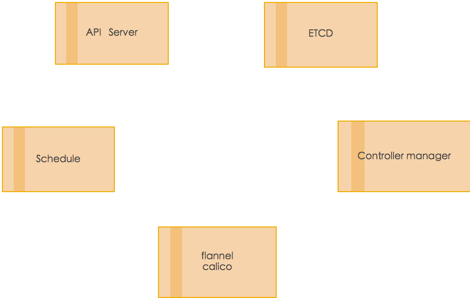
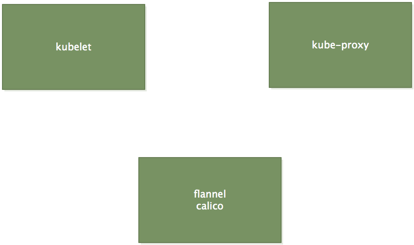
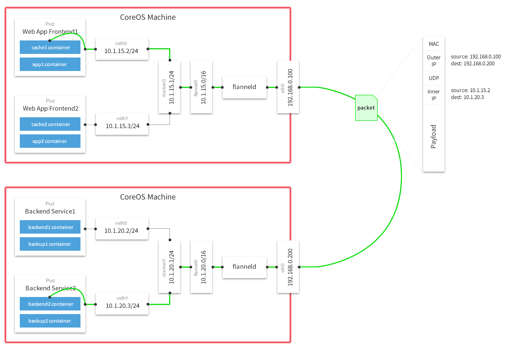

### master节点组件
   
   
   
   
     kube-apiserver  
     用于暴露kubernetes  API，不管是kubectl 还是HTTP 调用来操作kubernets 集群各种资源，都是通过kube-apiserver 提供的接口进行操作的，Node 节点与Master之间的通信也是主要依赖于kube-apiserver，例如pod调度: kube-scheduler 将调度结果写入etcd，kubelet 监听etcd 获取到调度任务。
     
           
     ETCD 
     一款用于共享配置和服务发现的高效KV存储系统，具有分布式、强一致性等特点，在kubernetes 环境中主要用于存储所有需要持久化的数据
     
     
     kube-controller-manager 
     管理负责整个kubernetes的管理工作，保障集群中各种资源处于期望状态，当监控到某个资源状态不正常时，管理控制器会触发对应的调度操作，主要由以下几个部分组成: 
     节点控制器(Node Controller)
     副本控制器(Replication  Controller)
     端点控制器(Endpoints Controller)
     命名空间控制器(Namespace Controller)
     身份认证控制器(Serviceaccounts  Controller)
     
     
     kube-scheduler 
     调度器，接收来自于管理控制器(kube-controller-manager)触发的调度操作请求，然后根据请求规格、调度约束、整体资源情况等因素进行调度计算，最后将任务写到etcd，目标节点的kubelet 组件监听到由其负责的资源创建工作，然后执行具体调度任务。 
     
     
     DNS
     
     能够为kubernetes services 提供DNS记录
     
  
### Node节点组件
       
       
   
     
     
     Node节点组件是指运行在Node节点上,负责具体POD 运行时环境的组件
     
     kubelet 
     kubelet是node的 agent，当scheduler 确定在某个Node上运行pod后，会将pod 的具体配置信息(image、volume 等)发送给该节点的kubelet，kubelet 根据这些信息创建和运行容器，并向master 报告运行状态。 
    
     kube-proxy 
     service 在逻辑上代表了后端多个pod，外界通过service 访问pod。service 接收到的请求是如何转发到pod的，这个就是kube-proxy 要完成的工作，
     每个node 都会运行kube-proxy服务，它负责将访问service的TCP/UDP 数据流转发到后端的容器，如果有多个副本，kube-proxy 会实现负载均衡，
     
     
     
     
### flannel原理
    
   
   
     数据从源容器发出后，经由所在主机的docker0 虚拟机网卡转发到flannel0 虚拟机网卡，这是个p2p的虚拟网卡，（flannel通过etcd 服务维护一张节点间的路由表）
     
     源主机的flannel 服务将原本的数据内容UDP 封装后根据自己的路由表投递给目的节点的flannel 服务，数据到达目的的flannel0 虚拟网卡，然后转发到目的主机的docker0 虚拟机网卡
     
     最后容器通信一下的docker0 的路由到达目标容器，这样整个数据包的传递就完成了
     
     
     
### calico 原理
    
     
     calico 包括如下重要组件: felix, etcd, BGP client, BGP Route Reflector 
     
     felix: 主要负责路由配置以及ACLS规则的配置以及下发，它存储在每个node 节点上
     etcd: 分布式键值存储，主要负责网络元数据一致性，确保calico 网络状态的准确性 
     
     BGPClient(BIRD): 主要负责把felix 写入kernel的路由信息分发到当前calico 网络，确保workload 间通信的有效性
     
     BGPRouter Reflector(BIRD): 大规模部署时候使用,摒弃所有节点互联的mesh 模式，通过一个或者多个BGPRouter  Reflector 来完成集中式的路由分发；
     
   
     
      calico 利用linux 内核本地的理由和iptables防火墙功能.来自于单个容器，虚拟机和主机的所有流量在路由到其目标之前会遍历这些内核中的规则，
      
      
      key/value存储: 保存calico 的策略和网络配置状态
      
      calico/node:  每个主机上运行，从键/值存储中读取相关的策略和网络配置信息，并在linux 内核中实现
      
      
      
      
     
     
     
         
     
     
     
     
     
     
     
     
     
     
     
     
     
     
     
     
     
