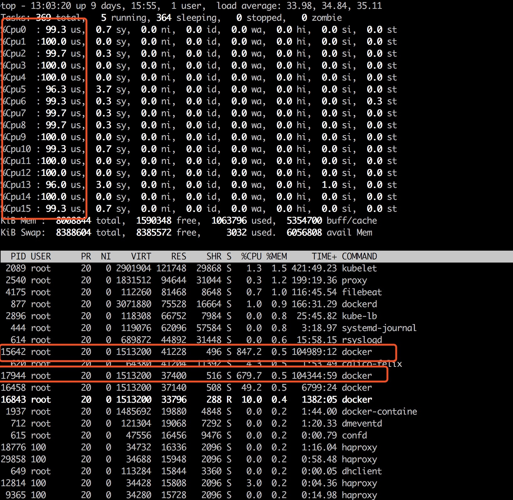
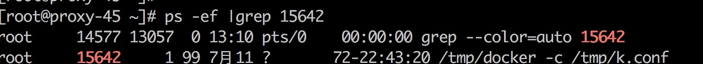
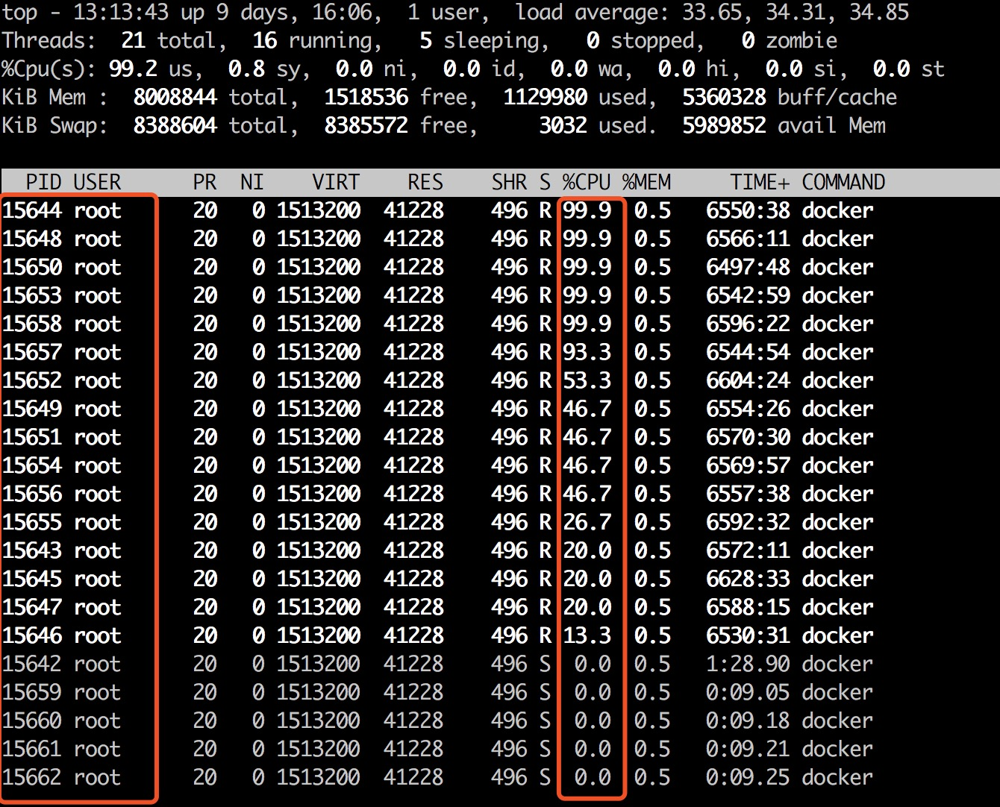

### 挖矿程序入侵服务解决
     监控报警CPU 100了  
   
     
      
    看到了15642   17944 进程占用的cpu 特别高
    使用ps -ef |grep pid 查看执行的程序
   
    
    使用top -H  -p  pid 查看执行的线程，看到线程占用的cpu都非常高
   
    
    因为运行的docker 容器， /tmp/docker -c /tmp/k.conf 这个执行程序可能是容器运行的
    
    